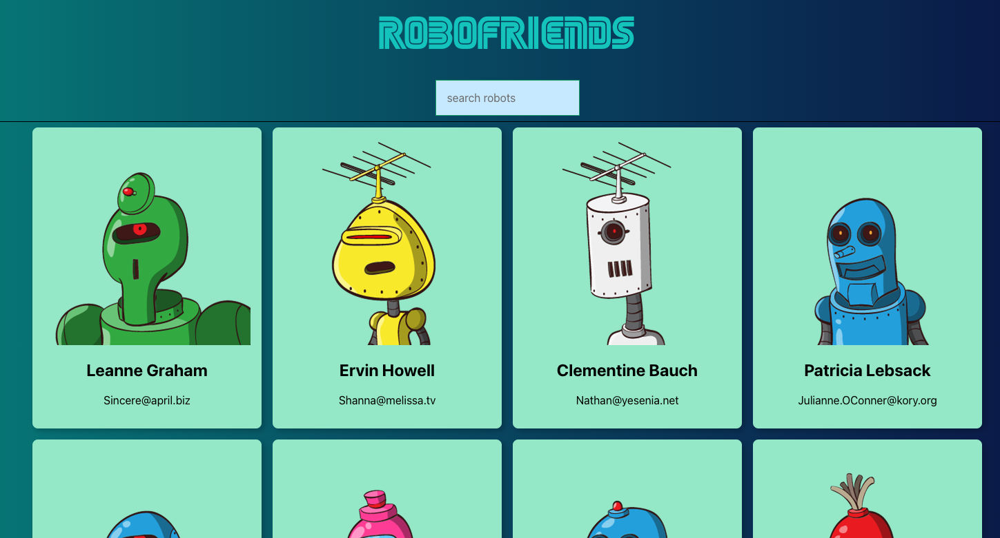

# 🤖 RoboFriends Renewed

A React application that showcases a collection of robot friends with search functionality and state management using Redux.

## About

RoboFriends Renewed is a modern React application built with the latest technologies. It features a searchable interface for browsing through a list of robotic characters, demonstrating core React concepts and Redux state management patterns.



## Features

- 🔍 **Search Functionality** - Easily search through robot profiles
- 🎨 **Clean UI** - Built with Tachyons CSS framework
- 📦 **State Management** - Redux with middleware for predictable state updates
- 🧪 **Testing** - Comprehensive test setup with React Testing Library
- 🚀 **GitHub Pages Deployment** - Easily deploy to GitHub Pages

## Tech Stack

- **Frontend Framework**: [React](https://react.dev/) (v19.2.5)
- **State Management**: [Redux](https://redux.js.org/) (v5.0.1)
- **Redux Middleware**:
  - [Redux Thunk](https://github.com/reduxjs/redux-thunk) - Async actions
  - [Redux Logger](https://github.com/LogRocket/redux-logger) - State logging
- **CSS Framework**: [Tachyons](https://tachyons.io/) (v4.12.0)
- **Testing**: React Testing Library with Jest
- **Deployment**: [gh-pages](https://pages.github.com/)

### Language Composition

- **JavaScript**: 81.3%
- **HTML**: 13.2%
- **CSS**: 5.5%

## Getting Started

### Prerequisites

- Node.js (v14 or higher)
- npm or yarn

### Installation

1. **Clone the repository**

   ```bash
   git clone https://github.com/pikede/robofriends-renewed.git
   cd robofriends-renewed
   ```

2. **Install dependencies**
   ```bash
   npm install
   ```

3. **Start the development server**
   ```bash
   npm start
   ```

The app will open at `http://localhost:3000`

## Available Scripts

- **`npm start`** - Runs the app in development mode
- **`npm build`** - Builds the app for production to the `build` folder
- **`npm test`** - Launches the test runner in interactive watch mode
- **`npm run deploy`** - Deploys the app to GitHub Pages
- **`npm run eject`** - Ejects from Create React App (⚠️ irreversible)

## Project Structure

```
robofriends-renewed/
├── public/              # Static files
├── src/                 # Source files
│   ├── components/      # React components
│   ├── actions/         # Redux actions
│   ├── reducers/        # Redux reducers
│   └── ...
├── package.json         # Dependencies and scripts
└── README.md           # This file
```

## Deployment

Deploy to GitHub Pages with a single command:

```bash
npm run deploy
```

The app will be available at: https://pikede.github.io/robofriends-renewed/

## Testing

Run tests in interactive watch mode:

```bash
npm test
```

## Browser Support

Supports all modern browsers with the following minimum versions:
- Chrome (latest)
- Firefox (latest)
- Safari (latest)

## Contributing

Contributions are welcome! Feel free to open issues or submit pull requests to improve the project.

## License

This project is open source and available under the MIT License.

## Live Demo

Visit the live application: [https://pikede.github.io/robofriends-renewed/](https://pikede.github.io/robofriends-renewed/)

---

Made with ❤️ by [pikede](https://github.com/pikede)
